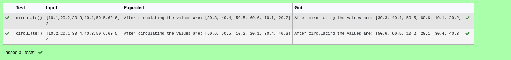

# Circulate-the-values-of-N-variables
## Aim:
To write a python program to circulate the n variables using function concept
## Equipment’s required:
PC
Anaconda - Python 3.7
## Algorithm: 
### Step 1: 
Defining a function

### Step 2: 
Get the value from the user for the number of rotation 

### Step 3: 
Defining datatypes for the input

### Step 4: 
Using the slicing concept rotate the list

### Step 5: 
Print the output

### Step 6: 
End the program
## Program:
```#Program to circulate N values.
#Developed by: NAVIN KUMAR J
#RegisterNumber: 22009212

def circulate():
 l=eval(input())
 n=int(input())
 print("After circulating the values are:",l[n:]+l[:n])
 ```

## Output:


## Result:
Thus the swapping of two values are successfully executed
